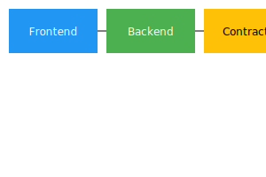

# VWA-XRP Architecture

## Components
1. **Frontend Dashboard** – User-facing portal (wallet connection, asset management).
2. **Backend API** – Manages asset data and marketplace logic.
3. **Smart Contracts** – Token issuance and asset logic.

## Diagram

